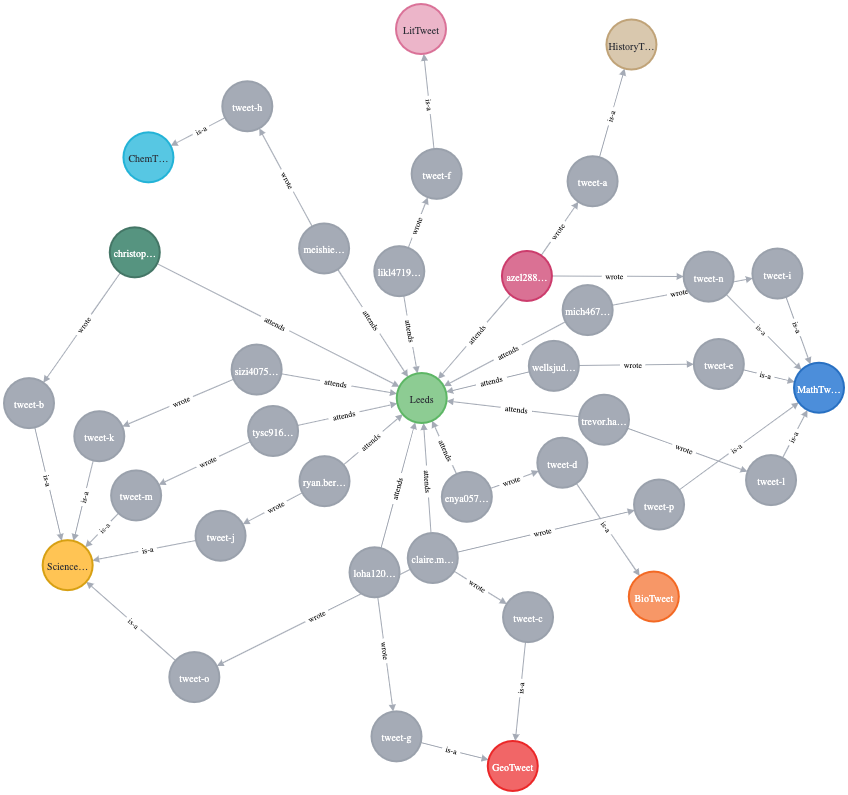

<h1 align="center" style="border-bottom: none;">🔎 Docker 101 </h1>
<h3 align="center">Docker is an open-source project that automates the deployment of software applications inside containers by providing an additional layer of abstraction and automation of OS-level virtualization on Linux..</h3>


### Flow

In this course, you'll follow a series of hands-on exercises that demonstrate how to use containers for your applications. You'll start with the basics: creating and running your first Docker containers. By the end of the course, you'll get a brief introduction to running containers in production.


Enjoy the course!

<h3>BADM-4830</h3>
</p>

1. login to the development virtual machine VM hosted on AWS cloud

	 `
    ssh ubuntu@XX.XXX.XXX.XXX
    `
    
    *Make sure to post your **ssh public key** to the Watson studio project used for this lesson
    
2. Navigate to class subdirectory

	`cd /home/ubuntu/4830`
3. Create & navigate to your own directory

	`mkdir userName`
	
	`cd userName`
	
	For example:
	
	`mkdir ivanp`
	
	`cd ivanp`
	
	
4. Clone Module 7 repository from github

	`git clone https://github.com/jiportilla/leeds-module-7.git`
	
5. Change directory to the module 7 directory

	`cd leeds-module-7/`
6. Test your `docker` installation by running the following command:

	`docker run hello-world`
	
	You will see:
	
	```
	Hello from Docker.
	This message shows that your installation appears to be working correctly.
	...
	
	```
	
### Hello World

7. Next, we are going to run a `Busybox` container on our system and get a taste of the `docker run` command. To get started, let's run the following in our terminal:.

	```
	docker pull busybox
	```
	You will see:
	
	```	
	Using default tag: latest
	latest: Pulling from library/busybox
	...
	```

	The `pull` command fetches the busybox image from the Docker registry and saves it to your system. You can use the docker images command to see a list of all images on your system.
	
	`docker images`

8. Great! Let's now run a Docker container based on this image. Run the following command:

 `docker run busybox echo "Hello World from busybox`

9. Let's run a terminal in the busybox container with:

 `docker run -it busybox /bin/sh`
 
 Test you are running inside the container with:
 
 `ls`
 
 You will see:
 
 ```
bin   dev   etc   home  proc  root  sys   tmp   usr   var
 ```
 
 Exit the container
 
 `exit`

### Static Site

The first thing we're going to look at is how we can run a dead-simple static website. We're going to pull a Docker image from Docker Hub, run the container and see how easy it is to run a webserver.

1. Detached mode, run

`docker run -d -p 80:80 --name static-site prakhar1989/static-site`

In the above command, `-d` will detach our terminal, `-P` will publish all exposed ports to `80:80` and finally `--name` corresponds to a name we want to give. Now we can see the ports by running the `docker port [CONTAINER]` command:

`docker port static-site`

Check your browser to

`http://XX.XXX.XXX.XXX`

Using the IP address above.

Check running containers with

`docker ps`

Stop running container with:

`docker stop static-site`

Prune stopped containers with:

`docker container prune`


## Docker Images

We have looked at images before, but in this section we'll dive deeper into what Docker images are and build our own image! Lastly, we'll also use that image to run our application locally and finally deploy on AWS to share it with our friends! Excited? Great! Let's get started.

Docker images are the basis of containers. In the previous example, we pulled the Busybox image from the registry and asked the Docker client to run a container based on that image. To see the list of images that are available locally, use the docker images command.

`docker images`

Let's create an webapp image with the followig `Make` commands:


1. Make clean

   ```
   make clean
   ```

1. Build the image

   ```
   make build
   ```

1. Run the container

   ```
   make run
   ```

1. View the application in a browser at `XX.XXX.XXX.XXX:PORT`

where `XX.XXX.XXX.XXX` is the IP we used in the login step above and `PORT` is the port number provided in the `.env` file earlier.

## Graph Databases

A graph database stores nodes and relationships instead of tables, or documents. Data is stored just like you might sketch ideas on a whiteboard. Your data is stored without restricting it to a pre-defined model, allowing a very flexible way of thinking about and using it.


Open Python notebook in Watson Studio project



[https://neo4j.com/developer/graph-database/](https://neo4j.com/developer/graph-database/)

## License

This sample code is licensed under the [MIT License](https://opensource.org/licenses/MIT).

## Open Source @ IBM

Find more open source projects on the [IBM Github Page](http://ibm.github.io/)

